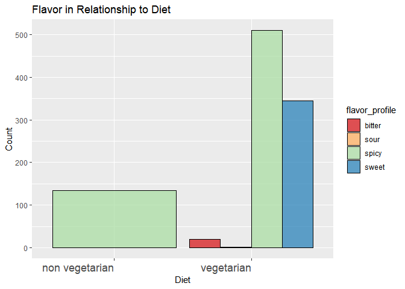
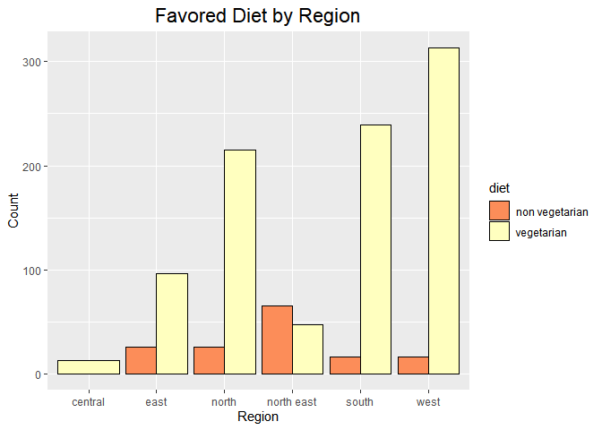
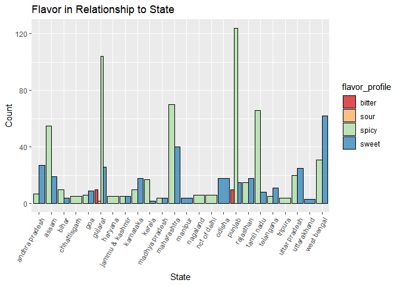

## Background of Project

Welcome to the Exploring India Cookbook, this an e-cook book that will allow you to select different dishes you would like to make depending on your diet, amount of time you have, the course you would like to make, or based on the region. 

This project is separated into three parts:
Section 1: Loading and Cleaning the Data
Section 2: Questions about the data
Section 3: Exploring India Cookbook App


## Section 1:

This section illustrates how we loaded the data, assessed the data structure, and cleaned the data. 
_Load Library_


```r
library(tidyverse)
```

```
## -- Attaching packages --------------------------------------- tidyverse 1.3.1 --
```

```
## v ggplot2 3.3.5     v purrr   0.3.4
## v tibble  3.1.6     v dplyr   1.0.8
## v tidyr   1.2.0     v stringr 1.4.0
## v readr   2.1.2     v forcats 0.5.1
```

```
## -- Conflicts ------------------------------------------ tidyverse_conflicts() --
## x dplyr::filter() masks stats::filter()
## x dplyr::lag()    masks stats::lag()
```

```r
library(RColorBrewer)
library(paletteer)
library(janitor)
```

```
## 
## Attaching package: 'janitor'
```

```
## The following objects are masked from 'package:stats':
## 
##     chisq.test, fisher.test
```

```r
library(here)
```

```
## here() starts at C:/Users/Emily/Desktop/GitHub/BIS15W2022_Group2
```

```r
library(naniar)
library(gapminder)
library(shinydashboard)
```

```
## 
## Attaching package: 'shinydashboard'
```

```
## The following object is masked from 'package:graphics':
## 
##     box
```

```r
library(ggthemes)
library(shiny)
```


a. Load the data. 

```r
indian_food<- read_csv(here("indian_food_data.csv"))%>% clean_names()
```

```
## Rows: 255 Columns: 9
## -- Column specification --------------------------------------------------------
## Delimiter: ","
## chr (7): name, ingredients, diet, flavor_profile, course, state, region
## dbl (2): prep_time, cook_time
## 
## i Use `spec()` to retrieve the full column specification for this data.
## i Specify the column types or set `show_col_types = FALSE` to quiet this message.
```
b. Structure of the data. 

```r
glimpse(indian_food)
```

```
## Rows: 255
## Columns: 9
## $ name           <chr> "Balu shahi", "Boondi", "Gajar ka halwa", "Ghevar", "Gu~
## $ ingredients    <chr> "Maida flour, yogurt, oil, sugar", "Gram flour, ghee, s~
## $ diet           <chr> "vegetarian", "vegetarian", "vegetarian", "vegetarian",~
## $ prep_time      <dbl> 45, 80, 15, 15, 15, 10, 10, 10, 20, 10, 10, 5, 20, 10, ~
## $ cook_time      <dbl> 25, 30, 60, 30, 40, 50, 50, 20, 30, 40, 40, 5, 30, 30, ~
## $ flavor_profile <chr> "sweet", "sweet", "sweet", "sweet", "sweet", "sweet", "~
## $ course         <chr> "dessert", "dessert", "dessert", "dessert", "dessert", ~
## $ state          <chr> "West Bengal", "Rajasthan", "Punjab", "Rajasthan", "Wes~
## $ region         <chr> "East", "West", "North", "West", "East", "East", "North~
```


```r
summary(indian_food)
```

```
##      name           ingredients            diet             prep_time     
##  Length:255         Length:255         Length:255         Min.   : -1.00  
##  Class :character   Class :character   Class :character   1st Qu.: 10.00  
##  Mode  :character   Mode  :character   Mode  :character   Median : 10.00  
##                                                           Mean   : 31.11  
##                                                           3rd Qu.: 20.00  
##                                                           Max.   :500.00  
##    cook_time      flavor_profile        course             state          
##  Min.   : -1.00   Length:255         Length:255         Length:255        
##  1st Qu.: 20.00   Class :character   Class :character   Class :character  
##  Median : 30.00   Mode  :character   Mode  :character   Mode  :character  
##  Mean   : 34.53                                                           
##  3rd Qu.: 40.00                                                           
##  Max.   :720.00                                                           
##     region         
##  Length:255        
##  Class :character  
##  Mode  :character  
##                    
##                    
## 
```
c. What are the variables? 

```r
names(indian_food)
```

```
## [1] "name"           "ingredients"    "diet"           "prep_time"     
## [5] "cook_time"      "flavor_profile" "course"         "state"         
## [9] "region"
```

d. Dealing with NA's

_NA's in data is symbolized by a "-1"_

```r
indian_food<-indian_food%>%
  na_if("-1")
```

Counting Number of NA's

```r
naniar::miss_var_summary(indian_food)
```

```
## # A tibble: 9 x 3
##   variable       n_miss pct_miss
##   <chr>           <int>    <dbl>
## 1 prep_time          30    11.8 
## 2 flavor_profile     29    11.4 
## 3 cook_time          28    11.0 
## 4 state              24     9.41
## 5 region             14     5.49
## 6 name                0     0   
## 7 ingredients         0     0   
## 8 diet                0     0   
## 9 course              0     0
```
e. Split Ingredients Into Their Own Row

We noticed that the ingredients were listed in one row, so we separated them into their own rows. 


```r
indian_food<-indian_food%>%
  mutate_all(tolower)%>%
  transform(ingredients=str_split(ingredients,","))%>%
  unnest(ingredients)
indian_food
```

```
## # A tibble: 1,136 x 9
##    name        ingredients diet  prep_time cook_time flavor_profile course state
##    <chr>       <chr>       <chr> <chr>     <chr>     <chr>          <chr>  <chr>
##  1 balu shahi  "maida flo~ vege~ 45        25        sweet          desse~ west~
##  2 balu shahi  " yogurt"   vege~ 45        25        sweet          desse~ west~
##  3 balu shahi  " oil"      vege~ 45        25        sweet          desse~ west~
##  4 balu shahi  " sugar"    vege~ 45        25        sweet          desse~ west~
##  5 boondi      "gram flou~ vege~ 80        30        sweet          desse~ raja~
##  6 boondi      " ghee"     vege~ 80        30        sweet          desse~ raja~
##  7 boondi      " sugar"    vege~ 80        30        sweet          desse~ raja~
##  8 gajar ka h~ "carrots"   vege~ 15        60        sweet          desse~ punj~
##  9 gajar ka h~ " milk"     vege~ 15        60        sweet          desse~ punj~
## 10 gajar ka h~ " sugar"    vege~ 15        60        sweet          desse~ punj~
## # ... with 1,126 more rows, and 1 more variable: region <chr>
```

f. Adding Total Cook Time column which combines cook time and prep time. 

```r
indian_food<-indian_food%>%
  mutate(total_cook_time=as.numeric(cook_time)+as.numeric(prep_time))
indian_food
```

```
## # A tibble: 1,136 x 10
##    name        ingredients diet  prep_time cook_time flavor_profile course state
##    <chr>       <chr>       <chr> <chr>     <chr>     <chr>          <chr>  <chr>
##  1 balu shahi  "maida flo~ vege~ 45        25        sweet          desse~ west~
##  2 balu shahi  " yogurt"   vege~ 45        25        sweet          desse~ west~
##  3 balu shahi  " oil"      vege~ 45        25        sweet          desse~ west~
##  4 balu shahi  " sugar"    vege~ 45        25        sweet          desse~ west~
##  5 boondi      "gram flou~ vege~ 80        30        sweet          desse~ raja~
##  6 boondi      " ghee"     vege~ 80        30        sweet          desse~ raja~
##  7 boondi      " sugar"    vege~ 80        30        sweet          desse~ raja~
##  8 gajar ka h~ "carrots"   vege~ 15        60        sweet          desse~ punj~
##  9 gajar ka h~ " milk"     vege~ 15        60        sweet          desse~ punj~
## 10 gajar ka h~ " sugar"    vege~ 15        60        sweet          desse~ punj~
## # ... with 1,126 more rows, and 2 more variables: region <chr>,
## #   total_cook_time <dbl>
```
## Section Two: Questions about the data.
1. Does it take more or less time to cook vegetarian versus non-vegetarian dishes? ELLYN

```r
indian_food_together<- read_csv(here("indian_food_data.csv"))%>% clean_names()
```

```
## Rows: 255 Columns: 9
## -- Column specification --------------------------------------------------------
## Delimiter: ","
## chr (7): name, ingredients, diet, flavor_profile, course, state, region
## dbl (2): prep_time, cook_time
## 
## i Use `spec()` to retrieve the full column specification for this data.
## i Specify the column types or set `show_col_types = FALSE` to quiet this message.
```

```r
indian_food_together <- indian_food_together %>% 
  mutate_all(tolower)

indian_food_together <-indian_food_together%>%
  na_if("-1")

indian_food_together <- indian_food_together%>%
  mutate(cook_time=as.numeric(cook_time), prep_time=as.numeric(prep_time)) %>% 
  mutate(total_cook_time=cook_time+prep_time)


indian_food_together
```

```
## # A tibble: 255 x 10
##    name        ingredients diet  prep_time cook_time flavor_profile course state
##    <chr>       <chr>       <chr>     <dbl>     <dbl> <chr>          <chr>  <chr>
##  1 balu shahi  maida flou~ vege~        45        25 sweet          desse~ west~
##  2 boondi      gram flour~ vege~        80        30 sweet          desse~ raja~
##  3 gajar ka h~ carrots, m~ vege~        15        60 sweet          desse~ punj~
##  4 ghevar      flour, ghe~ vege~        15        30 sweet          desse~ raja~
##  5 gulab jamun milk powde~ vege~        15        40 sweet          desse~ west~
##  6 imarti      sugar syru~ vege~        10        50 sweet          desse~ west~
##  7 jalebi      maida, cor~ vege~        10        50 sweet          desse~ utta~
##  8 kaju katli  cashews, g~ vege~        10        20 sweet          desse~ <NA> 
##  9 kalakand    milk, cott~ vege~        20        30 sweet          desse~ west~
## 10 kheer       milk, rice~ vege~        10        40 sweet          desse~ <NA> 
## # ... with 245 more rows, and 2 more variables: region <chr>,
## #   total_cook_time <dbl>
```


```r
indian_food_together %>% 
  filter(!is.na(total_cook_time)) %>% 
 group_by(diet) %>% 
summarize(mean_total_time = mean(total_cook_time))
```

```
## # A tibble: 2 x 2
##   diet           mean_total_time
##   <chr>                    <dbl>
## 1 non vegetarian            81.8
## 2 vegetarian                73.4
```


```r
v_nv <- indian_food_together %>% 
   filter(!is.na(total_cook_time)) %>% 
  group_by(diet) %>% 
 summarize(mean_total_time = mean(total_cook_time),
          min_total_time = min(total_cook_time),
          max_total_time = max(total_cook_time))
v_nv
```

```
## # A tibble: 2 x 4
##   diet           mean_total_time min_total_time max_total_time
##   <chr>                    <dbl>          <dbl>          <dbl>
## 1 non vegetarian            81.8             20            270
## 2 vegetarian                73.4             10            730
```


```r
v_nv_long <- v_nv%>%
pivot_longer(-diet, names_to ="time", values_to="cook_time")
v_nv_long
```

```
## # A tibble: 6 x 3
##   diet           time            cook_time
##   <chr>          <chr>               <dbl>
## 1 non vegetarian mean_total_time      81.8
## 2 non vegetarian min_total_time       20  
## 3 non vegetarian max_total_time      270  
## 4 vegetarian     mean_total_time      73.4
## 5 vegetarian     min_total_time       10  
## 6 vegetarian     max_total_time      730
```

```r
v_nv_plot <- v_nv_long %>% 
  ggplot(aes(x=time, y=cook_time, fill=diet))+geom_col(position = "dodge")
v_nv_plot + theme_clean()+scale_fill_brewer(palette = "Spectral")+labs(title="Total Cook Time", x="Diet", y="Total Cook Time")
```

<!-- -->
2. For each diet, vegetarian and non-vegetarian, identify which dish takes the most and least amount of total cook time, prep time, and cook time. ELLYN

```r
indian_food_together %>% 
  filter(diet == "non vegetarian") %>% 
  filter(total_cook_time == 20) 
```

```
## # A tibble: 1 x 10
##   name  ingredients diet  prep_time cook_time flavor_profile course state region
##   <chr> <chr>       <chr>     <dbl>     <dbl> <chr>          <chr>  <chr> <chr> 
## 1 galho rice, axon~ non ~         5        15 spicy          main ~ naga~ north~
## # ... with 1 more variable: total_cook_time <dbl>
```

```r
indian_food_together %>% 
  filter(diet == "non vegetarian") %>% 
  filter(total_cook_time == 270) 
```

```
## # A tibble: 2 x 10
##   name  ingredients diet  prep_time cook_time flavor_profile course state region
##   <chr> <chr>       <chr>     <dbl>     <dbl> <chr>          <chr>  <chr> <chr> 
## 1 tand~ greek yogu~ non ~       240        30 spicy          main ~ punj~ north 
## 2 tand~ chickpea f~ non ~       240        30 spicy          start~ punj~ north 
## # ... with 1 more variable: total_cook_time <dbl>
```


```r
indian_food_together %>% 
  filter(diet == "vegetarian") %>% 
  filter(total_cook_time == 730)
```

```
## # A tibble: 1 x 10
##   name  ingredients diet  prep_time cook_time flavor_profile course state region
##   <chr> <chr>       <chr>     <dbl>     <dbl> <chr>          <chr>  <chr> <chr> 
## 1 shri~ curd, suga~ vege~        10       720 sweet          desse~ maha~ west  
## # ... with 1 more variable: total_cook_time <dbl>
```

```r
indian_food_together %>% 
 filter(diet == "vegetarian") %>% 
  filter(total_cook_time == 10)
```

```
## # A tibble: 3 x 10
##   name  ingredients diet  prep_time cook_time flavor_profile course state region
##   <chr> <chr>       <chr>     <dbl>     <dbl> <chr>          <chr>  <chr> <chr> 
## 1 lassi yogurt, mi~ vege~         5         5 sweet          desse~ punj~ north 
## 2 papad urad dal, ~ vege~         5         5 spicy          snack  <NA>  <NA>  
## 3 papa~ lentils, b~ vege~         5         5 spicy          snack  kera~ south 
## # ... with 1 more variable: total_cook_time <dbl>
```


3. What is the relationship between flavor and diet (i.e. is there more spicy dishes in non-vegetarian compared to vegetarian?) RACHEL

```r
flavor_diet <- indian_food %>% 
  filter(!is.na(flavor_profile)) %>%
  ggplot(aes(x=diet, fill=flavor_profile))+
  geom_bar(na.rm=T, position="dodge",alpha=0.75, color="black") +
  labs(title = "Flavor in Relationship to Diet",
       x = "Diet",
       y = "Count") +
  theme(plot.title = element_text(size = rel(1.5), hjust = 0.5))
flavor_diet
```

<!-- -->

4. Which ingredient is used the most for each region? EMILY

```r
indian_food%>%
  select(region, ingredients)%>%
  group_by(region)%>%
  count(ingredients)%>%
  arrange(desc(n))
```

```
## # A tibble: 685 x 3
## # Groups:   region [7]
##    region     ingredients         n
##    <chr>      <chr>           <int>
##  1 north      " garam masala"    22
##  2 south      " curry leaves"    15
##  3 east       " sugar"           14
##  4 south      " urad dal"        12
##  5 west       " sugar"           12
##  6 north      " ginger"          10
##  7 south      " jaggery"          9
##  8 north east " mustard oil"      8
##  9 south      " sugar"            8
## 10 south      "chana dal"         8
## # ... with 675 more rows
```


5. What ingredient is used the most out of all the courses? EMILY

```r
indian_food%>%
  select(ingredients,name)%>%
  count(ingredients)%>%
  arrange(desc(n))%>%
  head(n=5)
```

```
## # A tibble: 5 x 2
##   ingredients         n
##   <chr>           <int>
## 1 " sugar"           45
## 2 " ginger"          29
## 3 " garam masala"    27
## 4 " curry leaves"    25
## 5 " ghee"            25
```

6. What diet is more associated with which region/state? GABE

```r
diet_region<-indian_food%>%
select("region", "diet")%>%
  filter(!is.na(region))
  #count(region, diet)%>%
  #arrange(desc(n))
diet_region
```

```
## # A tibble: 1,072 x 2
##    region diet      
##    <chr>  <chr>     
##  1 east   vegetarian
##  2 east   vegetarian
##  3 east   vegetarian
##  4 east   vegetarian
##  5 west   vegetarian
##  6 west   vegetarian
##  7 west   vegetarian
##  8 north  vegetarian
##  9 north  vegetarian
## 10 north  vegetarian
## # ... with 1,062 more rows
```


```r
diet_region%>%
 ggplot(aes(x=region, fill=diet))+
  geom_bar(na.rm=T, position="dodge", color="black") +
  labs(title = "Favored Diet by Region",
       x = "Region",
       y = "Count") +
  theme(plot.title = element_text(size = rel(1.5), hjust = 0.5))+
   theme(axis.text.x = element_text(hjust = 0.5))+
  scale_fill_brewer(palette="Spectral")
```

<!-- -->

7. What flavor profile is more associated with which region/state? RACHEL

```r
flavor_state <- indian_food %>% 
  filter(!is.na(flavor_profile)) %>%
  filter(!is.na(state)) %>%
  ggplot(aes(x=state, fill=flavor_profile))+
  geom_bar(na.rm=T, position="dodge",alpha=0.75, color="black") +
  labs(title = "Flavor in Relationship to State",
       x = "State",
       y = "Count") +
  theme(plot.title = element_text(size = rel(1.0), hjust = 0.5))+
   theme(axis.text.x = element_text(angle = 60, hjust = 1)) 
flavor_state
```

<!-- -->

8. What is the population growth, GDP growth, and life expectancy of India (use gapminder data)? GABE

```r
gapminder
```

```
## # A tibble: 1,704 x 6
##    country     continent  year lifeExp      pop gdpPercap
##    <fct>       <fct>     <int>   <dbl>    <int>     <dbl>
##  1 Afghanistan Asia       1952    28.8  8425333      779.
##  2 Afghanistan Asia       1957    30.3  9240934      821.
##  3 Afghanistan Asia       1962    32.0 10267083      853.
##  4 Afghanistan Asia       1967    34.0 11537966      836.
##  5 Afghanistan Asia       1972    36.1 13079460      740.
##  6 Afghanistan Asia       1977    38.4 14880372      786.
##  7 Afghanistan Asia       1982    39.9 12881816      978.
##  8 Afghanistan Asia       1987    40.8 13867957      852.
##  9 Afghanistan Asia       1992    41.7 16317921      649.
## 10 Afghanistan Asia       1997    41.8 22227415      635.
## # ... with 1,694 more rows
```


```r
india_gapminder<-gapminder%>%
filter(country=="India")
india_gapminder
```

```
## # A tibble: 12 x 6
##    country continent  year lifeExp        pop gdpPercap
##    <fct>   <fct>     <int>   <dbl>      <int>     <dbl>
##  1 India   Asia       1952    37.4  372000000      547.
##  2 India   Asia       1957    40.2  409000000      590.
##  3 India   Asia       1962    43.6  454000000      658.
##  4 India   Asia       1967    47.2  506000000      701.
##  5 India   Asia       1972    50.7  567000000      724.
##  6 India   Asia       1977    54.2  634000000      813.
##  7 India   Asia       1982    56.6  708000000      856.
##  8 India   Asia       1987    58.6  788000000      977.
##  9 India   Asia       1992    60.2  872000000     1164.
## 10 India   Asia       1997    61.8  959000000     1459.
## 11 India   Asia       2002    62.9 1034172547     1747.
## 12 India   Asia       2007    64.7 1110396331     2452.
```


```r
ui <- dashboardPage(
  dashboardHeader(title = "India Gapminder"), 
  dashboardSidebar(disable = T),
  dashboardBody(
    fluidRow(box(title = "Options", width = 5, 
               selectInput("y", "Information", choices = c("lifeExp","pop","gdpPercap"), selected = "lifeExp")
               ),
  plotOutput("plot", width = "650px", height = "550px"))
    )
)
               

server <- function(input, output, session) { 
  output$plot <- renderPlot({
  india_gapminder%>%
  ggplot(aes_string(x=india_gapminder$year, y=input$y, group=1))+
  geom_line()+
  theme(axis.text.x = element_text( hjust = 0.5, size = 12))+
      labs( title = "Background Information on India",
       x ="Year",
       y= NULL,
       fill= "Information")
  }) 
}
shinyApp(ui, server)
```

`<div style="width: 100% ; height: 400px ; text-align: center; box-sizing: border-box; -moz-box-sizing: border-box; -webkit-box-sizing: border-box;" class="muted well">Shiny applications not supported in static R Markdown documents</div>`{=html}

9. What is the distribution of courses (e.g. main courses, snacks, dessert)? EMILY

```r
indian_food%>%
  ggplot(aes(x=course, fill=course))+geom_bar()+theme_clean()+scale_fill_brewer(palette = "Spectral")+labs(title="Distribution of Courses", x="Course", y="Count")
```

<!-- -->


10. Does agriculture by region have an impact on diet? Ellyn

a. We started by uploading the data on agriculture and cleaning it up.

```r
agriculture <-  read_csv(here("agriculture.csv"))%>% clean_names()
```

```
## Rows: 49 Columns: 6
## -- Column specification --------------------------------------------------------
## Delimiter: ","
## chr (2): Crop, State
## dbl (4): Cost of Cultivation (`/Hectare) A2+FL, Cost of Cultivation (`/Hecta...
## 
## i Use `spec()` to retrieve the full column specification for this data.
## i Specify the column types or set `show_col_types = FALSE` to quiet this message.
```

```r
agriculture <- agriculture %>% 
  mutate_all(tolower)

agriculture <- agriculture %>% 
  select("crop", "state")

agriculture
```

```
## # A tibble: 49 x 2
##    crop   state         
##    <chr>  <chr>         
##  1 arhar  uttar pradesh 
##  2 arhar  karnataka     
##  3 arhar  gujarat       
##  4 arhar  andhra pradesh
##  5 arhar  maharashtra   
##  6 cotton maharashtra   
##  7 cotton punjab        
##  8 cotton andhra pradesh
##  9 cotton gujarat       
## 10 cotton haryana       
## # ... with 39 more rows
```

b. Both datasets shared a similar region column, which we used to merge the two.

```r
agr_diet <- full_join(indian_food_together, agriculture, by="state")
agr_diet
```

```
## # A tibble: 773 x 11
##    name        ingredients diet  prep_time cook_time flavor_profile course state
##    <chr>       <chr>       <chr>     <dbl>     <dbl> <chr>          <chr>  <chr>
##  1 balu shahi  maida flou~ vege~        45        25 sweet          desse~ west~
##  2 boondi      gram flour~ vege~        80        30 sweet          desse~ raja~
##  3 boondi      gram flour~ vege~        80        30 sweet          desse~ raja~
##  4 boondi      gram flour~ vege~        80        30 sweet          desse~ raja~
##  5 boondi      gram flour~ vege~        80        30 sweet          desse~ raja~
##  6 boondi      gram flour~ vege~        80        30 sweet          desse~ raja~
##  7 gajar ka h~ carrots, m~ vege~        15        60 sweet          desse~ punj~
##  8 gajar ka h~ carrots, m~ vege~        15        60 sweet          desse~ punj~
##  9 gajar ka h~ carrots, m~ vege~        15        60 sweet          desse~ punj~
## 10 ghevar      flour, ghe~ vege~        15        30 sweet          desse~ raja~
## # ... with 763 more rows, and 3 more variables: region <chr>,
## #   total_cook_time <dbl>, crop <chr>
```

c. Does the specialty crop have an impact on the total cook time? 

```r
agr_diet_plot <- agr_diet %>% 
 filter(crop!="NA") %>% 
  filter(total_cook_time!="NA") %>% 
  ggplot(aes(x=crop, y=total_cook_time, fill=crop))+geom_boxplot(color="white", alpha=.4, na.rm = TRUE)+
  geom_violin(alpha=.7, na.rm=TRUE)+ ylim(0,180)+coord_flip()
agr_diet_plot+theme_clean()+scale_fill_brewer(palette = "Spectral")
```

<!-- -->

## Section Three: Exploring Indian Food E-Cookbook App
Shiny App EMILY

```r
library(shiny)
library(DT)
```

```
## 
## Attaching package: 'DT'
```

```
## The following objects are masked from 'package:shiny':
## 
##     dataTableOutput, renderDataTable
```

```r
library(ggplot2)

ui <- fluidPage(
  titlePanel("Welcome to the Indian Food E-Cookbook"),
  sidebarLayout(
    sidebarPanel(
      checkboxGroupInput("show_vars", "Select What You Want To Find", names(indian_food), selected=names(indian_food))
    ), helpText("Welcome to the Indian Food E-Cookbook! Indian cuisine consists of a variety of regional and traditional cuisines native to the Indian subcontinent. Given the diversity in soil, climate, culture, ethnic groups, and occupations, these cuisines vary substantially and use locally available spices, herbs, vegetables, and fruits. Indian food is also heavily influenced by religion, in particular Hinduism, cultural choices and traditions.

This dataset consists of information about various Indian dishes, their ingredients, their place of origin, etc.                                                     

Reference: Neha Prabhavalkar [https://www.kaggle.com/nehaprabhavalkar/indian-food-101]")),
  mainPanel(
    id='indian_food', 
    tabPanel("indian food", DT::dataTableOutput("mytable"))
  )
)


server <- function(input, output) {
  indian_food=indian_food[sample(nrow(indian_food), 1136),]
  output$mytable = DT::renderDataTable({
    DT::datatable(indian_food[,input$show_vars, drop=FALSE], options=list(orderClasses=TRUE))
  })
}


shinyApp(ui,server)
```

`<div style="width: 100% ; height: 400px ; text-align: center; box-sizing: border-box; -moz-box-sizing: border-box; -webkit-box-sizing: border-box;" class="muted well">Shiny applications not supported in static R Markdown documents</div>`{=html}


